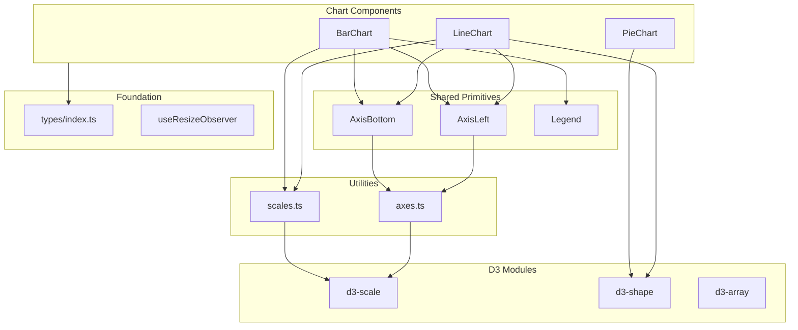

# Architecture

> Design philosophy, layer structure, data flow, and conventions for `@d3charts/react`.

## Design philosophy

1. **SVG-first** — Every chart renders a plain `<svg>` element. No Canvas, no WebGL.
2. **React owns the DOM** — All SVG elements are created declaratively via JSX. React handles creation, updates, and teardown through its normal reconciliation cycle.
3. **D3 for math only** — D3 modules are used exclusively for their computational capabilities (scales, shapes, array utilities). We never hand DOM nodes to D3's `select`/`transition` — this avoids conflicts with React's virtual DOM and keeps the rendering model predictable.

## Layer diagram

```
┌────────────────────────────────────────────────┐
│               Chart Components                 │
│       BarChart · LineChart · PieChart           │
├────────────────────────────────────────────────┤
│            Shared Primitives                   │
│     AxisBottom · AxisLeft · Legend              │
├────────────────────────────────────────────────┤
│              Utilities                         │
│     scales.ts          axes.ts                 │
├────────────────────────────────────────────────┤
│              Foundation                        │
│     types/index.ts     useResizeObserver        │
├────────────────────────────────────────────────┤
│              D3 Modules                        │
│     d3-scale · d3-shape · d3-array             │
└────────────────────────────────────────────────┘
```

Dependencies flow **downward only** — a chart component may import shared primitives and utilities, but never the reverse.



## Data flow

```
Props (data, keys, dimensions)
  │
  ▼
D3 scales (scaleBand, scaleLinear)
  │
  ▼
Tick generators (getBandTicks, getLinearTicks)  ──▶  Axis components
  │
  ▼
SVG elements (<rect>, <path>, <circle>, <g>)
```

Each chart component follows this pipeline:

1. **Receive props** — data array, dimension numbers, optional config.
2. **Compute inner dimensions** — subtract margins from width/height.
3. **Build D3 scales** — map data domain to pixel range.
4. **Generate ticks** — convert scales to `TickLine[]` arrays for axis rendering.
5. **Render SVG** — compose axes, data marks, and legend into a single `<svg>`.

## D3 modules — what we use and why

| Module     | Purpose                              | Example usage                 |
| ---------- | ------------------------------------ | ----------------------------- |
| `d3-scale` | Map data values to pixel coordinates | `scaleBand`, `scaleLinear`    |
| `d3-shape` | Generate SVG path data               | `line`, `pie`, `arc`, `stack` |
| `d3-array` | Array aggregation helpers            | `max`                         |

### What we explicitly avoid

| Module          | Why excluded                                                                |
| --------------- | --------------------------------------------------------------------------- |
| `d3-selection`  | React manages the DOM — using `select()` would conflict with reconciliation |
| `d3-transition` | React controls re-renders — D3 transitions would fight with React updates   |
| `d3-axis`       | Generates DOM imperatively — we use our own `AxisBottom`/`AxisLeft` instead |

## `'use client'` directive

All three chart components include `'use client'` at the top of the file. This is required for Next.js App Router compatibility — without it, these components (which use hooks and browser APIs indirectly) would fail in a server component context. Shared primitives (`AxisBottom`, `AxisLeft`, `Legend`) do not need the directive because they are pure presentational components with no hooks or side effects.

## File and folder conventions

```
src/
├── components/
│   ├── BarChart/
│   │   ├── BarChart.tsx           # Component
│   │   ├── BarChart.test.tsx      # Tests (vitest + RTL)
│   │   └── BarChart.stories.tsx   # Storybook stories
│   ├── LineChart/
│   │   └── ...                    # Same pattern
│   ├── PieChart/
│   │   └── ...                    # Same pattern
│   └── shared/
│       ├── AxisBottom.tsx
│       ├── AxisLeft.tsx
│       └── Legend.tsx
├── hooks/
│   └── useResizeObserver.ts
├── types/
│   └── index.ts
├── utils/
│   ├── axes.ts
│   └── scales.ts
├── index.ts                       # Public barrel export
└── test-setup.ts                  # Vitest setup
```

### Conventions

- **Colocation** — Each chart lives in its own directory with its tests and stories alongside the source.
- **Barrel export** — Only `src/index.ts` is the public API. Internal modules are not re-exported.
- **Naming** — PascalCase for components and their directories, camelCase for utilities and hooks.
- **No default exports** — All exports are named for better tree-shaking and IDE discovery.
- **Shared types** — Types used by more than one component live in `src/types/index.ts`. Component-specific props interfaces live in the component file and are re-exported from the barrel.
